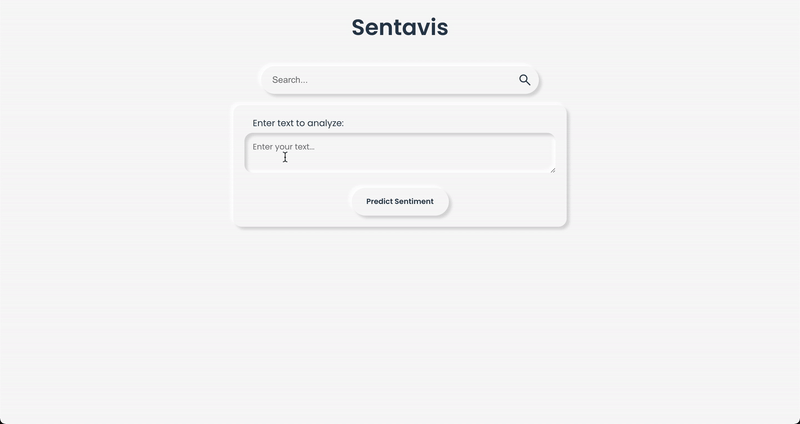

# Sentiment Analysis
The model is based on a CNN-BiLSTM network to identify text sentiment with an accuracy of up to 82%. 

The sentiment analysis project has two sections: front-end web app implemented in Vue to receive input from the user and a REST API implemented in Flask used to expose the model.

A demo of the front-end app is shown below.

